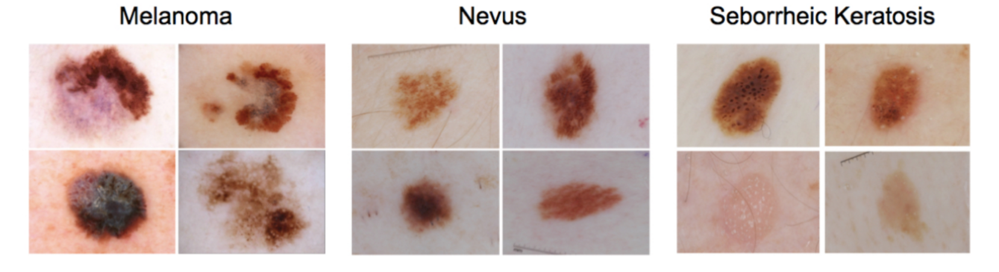

# Project Description

This is an classification algorithm among melanoma, nevus and seborrheic keratoses.

The datasets are from [kitware](https://challenge.kitware.com/#challenge/583f126bcad3a51cc66c8d9a)

Melanoma is the deadliest form of skin cancer, a deadly disease which kills about 10,000 people in the US annually. If the melanoma can be observed in an early phase and patients can get treatment in time, patients are very likely to be cured. However, melanoma resembles nevus and seborrheic keratoses, both of which can be found in healthy people, and only experienced doctor can distinguish among them.

If there exists an software which can easily recognize melanoma, thousands of lives can be saved every year. 

# What predecessors have done

- There have been [a competition in kitware](https://challenge.kitware.com/#challenge/583f126bcad3a51cc66c8d9a) named Skin Lesion Analysis Towards Melanoma Detection. [Some teams](https://arxiv.org/ftp/arxiv/papers/1703/1703.03108.pdf) used CNN to construct the algorithm, which can successfully identified more than 80% percent of melanoma.

- [This paper](https://www.nature.com/doifinder/10.1038/nature21056) use transfer learning by utilizing the GoogleNet Inception v3 model to get a dermatologist-level classification of skin cancer.

- [There](https://www.kaggle.com/kmader/skin-cancer-mnist-ham10000) is a large dataset of multi-source dermatoscopic images of pigmented lesions.

# What I plan to do

- Use computer vision technique to pretreat images to remove noise

- Design a better neural network model to fit the problem

- Try to put the software into a hospital

- Try to spread the model to recognize other diseases